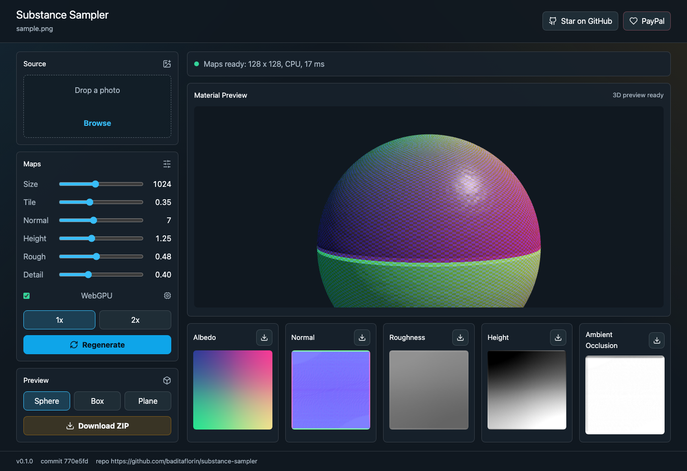
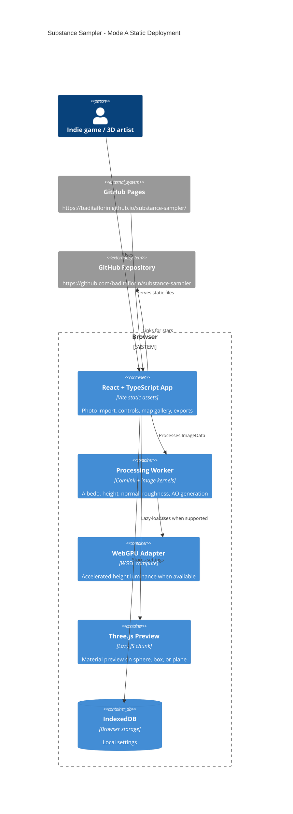

# Substance Sampler


Browser-based photo-to-PBR texture creation for indie game and 3D artists, powered by WebGPU-capable browser processing and lazy Three.js preview.

Live GitHub Pages URL:
https://baditaflorin.github.io/substance-sampler/

Repository:
https://github.com/baditaflorin/substance-sampler

Support development:
https://www.paypal.com/paypalme/florinbadita



## What It Does

Substance Sampler imports photos by picker, drag-drop, paste, CORS-readable URL, generated sample, or project-state import, then generates albedo, normal, roughness, height, and ambient occlusion texture maps fully in the browser. The page includes material/source analysis, per-map confidence, real-data warnings, live material preview, ZIP export with provenance metadata, metadata copy/download, project state export/import, settings links, local project restore, a GitHub star link, a PayPal support link, and visible version/commit metadata.

## Verified Features

- Photo inputs: picker, drag-drop, paste, CORS-readable URL, generated sample, multi-file queue, project import.
- Outputs: individual PNG maps, ZIP map bundle, metadata JSON, clipboard metadata, reloadable project JSON, settings-only share URL.
- Persistence: settings save immediately, last project restores from IndexedDB, Start Fresh clears local state.
- Validation: source bytes are sniffed before decode, project files are zod-validated, and URL/CORS failures are actionable.
- Tests: `make smoke` covers the happy path, real-data fixtures, and Phase 3 completeness flows.

## Quickstart

```sh
git clone https://github.com/baditaflorin/substance-sampler.git
cd substance-sampler
npm install
make install-hooks
make dev
```

## Common Commands

```sh
make build
make test
make lint
make smoke
make test-realdata
make pages-preview
```

## Architecture



More architecture detail:
https://github.com/baditaflorin/substance-sampler/blob/main/docs/architecture.md

Architecture decisions:
https://github.com/baditaflorin/substance-sampler/tree/main/docs/adr

Deployment notes:
https://github.com/baditaflorin/substance-sampler/blob/main/docs/deploy.md

Phase 2 substance audit and postmortem:
https://github.com/baditaflorin/substance-sampler/blob/main/docs/postmortem-phase2-substance.md

Phase 3 completeness audit:
https://github.com/baditaflorin/substance-sampler/tree/main/docs/phase3

Privacy:
https://github.com/baditaflorin/substance-sampler/blob/main/docs/privacy.md

## Browser Support

The app works with CPU fallbacks in modern Chromium, Firefox, and Safari-class browsers. WebGPU acceleration is used when `navigator.gpu` is available. Three.js preview requires WebGL.

## Limitations

- Image URL import only works for direct image URLs that allow browser CORS reads. Download and upload the file when a site blocks access.
- Settings links do not include source images; use project JSON export/import for full session transfer.
- Folder import, print/PDF reports, embed code, and runtime APIs are out of scope for the static GitHub Pages app.
- Real-ESRGAN, libigl, and scikit-image payloads are not bundled in this static release.

## Security

No runtime secrets are used. The frontend never stores API keys, tokens, or credentials. Local hooks run `gitleaks protect --staged` when `gitleaks` is installed.
