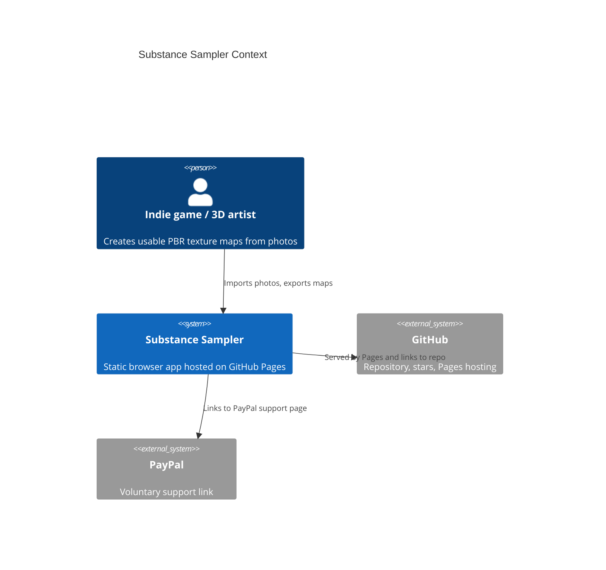
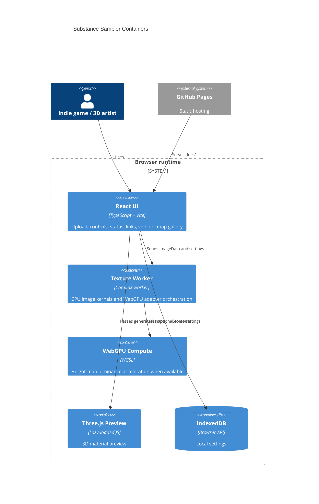

# Architecture

Substance Sampler is a Mode A GitHub Pages application. There is no runtime backend, database, Docker image, nginx proxy, or server-side metrics stack.

Live site:
https://baditaflorin.github.io/substance-sampler/

Repository:
https://github.com/baditaflorin/substance-sampler

## Context

## Containers

## Module Boundaries

- `src/features/sampler/` owns upload, worker client, settings, and generated texture state.
- `src/lib/image/` owns deterministic image kernels and PNG/ZIP export.
- `src/lib/webgpu/` owns WebGPU feature detection and compute shaders.
- `src/features/preview/` owns the lazy Three.js renderer.
- `src/lib/storage/` owns IndexedDB access.
- `docs/` is both documentation and the GitHub Pages publish directory.

## Pages Boundary

GitHub Pages serves `docs/` from the `main` branch. `make build` writes hashed assets, `index.html`, `404.html`, `build-info.json`, the manifest, and service worker files into `docs/` while preserving documentation under `docs/adr/`.
